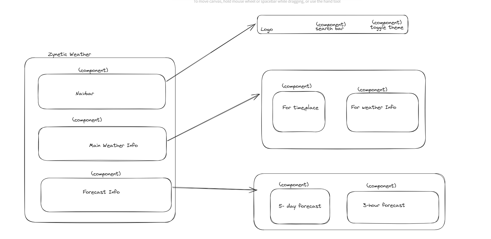
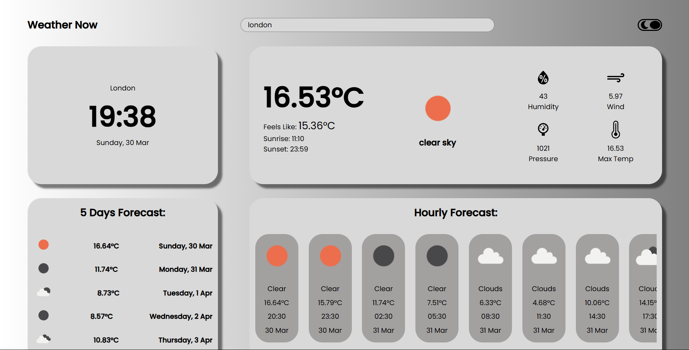

<h1>SetUp FrontEnd</h1>

**Zynetic Weather**

An application to search live weather either by city name or zip code, built with React, JavaScript, and SCSS.

**Features:**
* Search by city name or zip code
* 5-day weather forecast
* 3-hour weather forecast
* Dark/light theme
* Responsive across all devices
* Recent Search history
* Error and Loading ui

*Note:  Currently data being fetched by open weather api. Later will be switched to custom zynetic backend server.*

<h3>Project status</h3>

[Checkout Live working here](https://zyneticweather0.netlify.app/)

## Installation and Setup Instructions
 
**Steps:**
* Clone down this repository. You will need `node` and `npm` installed globally on your machine.
* Get Api key from open weather.  

Installation:

`npm install`  

To Run Test Suite:  

`npm test`  

To Start Server:

`npm start`  

To Visit App:

`localhost:3000`  

*Note:  Currently for easy access env file is provided. Will be removed later.*

## Application Flow Overview

* Application is divided in 3 parts
   * Navbar
   * Main Weather Info
   * Forecast Info

* Seperate context files are created along with custom hooks
   * Theme context
   * Main Weather Info context
   * Forecast Info context
   * Global Error context

* Utility : contains helper functions
   * Main weather info formatting function
   * Forecast weather info formatter
   * Other common helper functions like date ,time formatter     

<h5>Images</h5>

